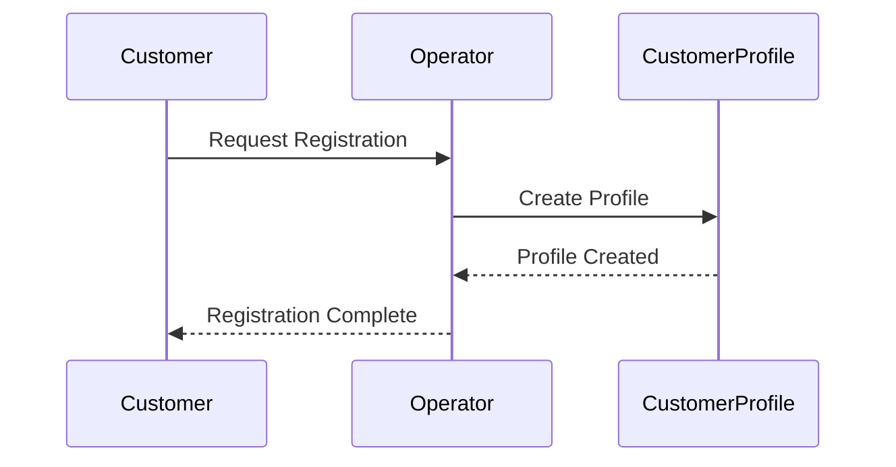
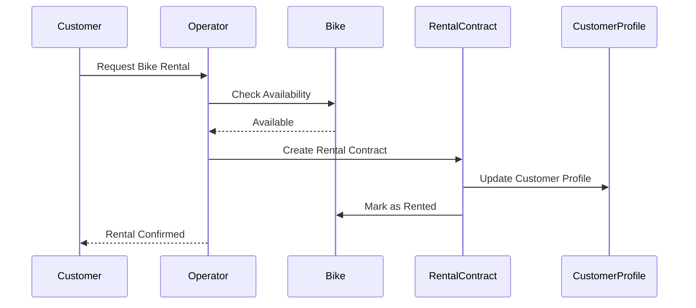
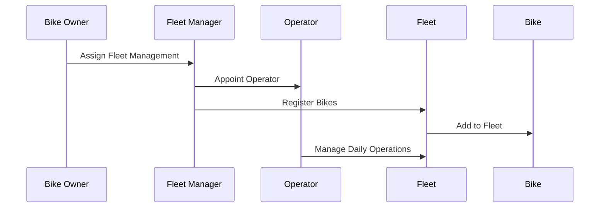

# Bike Rental System - Business Model & Party Structure

## 🎯 **Business Overview**

A bike rental system where:
- **Bike Owners** own the physical bikes
- **Fleet Managers** manage fleets at specific locations
- **Operators** handle day-to-day customer interactions
- **Customers** register and can rent bikes
- **Renters** are customers with active rental contracts

## 👥 **Party Hierarchy & Responsibilities**

```
Bike Owner (Company)
├── Fleet Manager (Location Manager)
│   ├── Operator (Customer Service)
│   └── Fleet (Bikes at Location)
└── Customer (Registered User)
    └── Renter (Active Rental)
```

### **Party Definitions:**

1. **Bike Owner**
   - Owns all bikes in the system
   - Appoints fleet managers
   - Sets pricing and policies
   - Views system-wide analytics

2. **Fleet Manager**
   - Manages bikes at specific location
   - Appoints operators for their location
   - Handles fleet maintenance decisions
   - Reports to bike owner

3. **Operator**
   - Handles customer interactions
   - Processes rentals and returns
   - Manages bike availability
   - Reports to fleet manager

4. **Customer**
   - Registered user in the system
   - Can view available bikes
   - Can initiate rental requests
   - Has profile with rental history

5. **Renter**
   - Customer with active rental contract
   - Has temporary rights to specific bike
   - Bound by rental terms

## 🔄 **Core Business Processes**

### **1. Customer Registration Process**


### **2. Bike Rental Process**


### **3. Fleet Management Process**


## 📋 **Protocol Design**

### **1. Bike Protocol**
- **Parties**: Bike Owner, Fleet Manager, Operator
- **Purpose**: Track individual bike state and location
- **States**: Available, Rented, Maintenance, Retired

### **2. Fleet Protocol**
- **Parties**: Bike Owner, Fleet Manager, Operator
- **Purpose**: Manage bikes at specific location
- **States**: Active, Maintenance, Decommissioned

### **3. Customer Profile Protocol**
- **Parties**: Customer, Operator
- **Purpose**: Customer registration and history
- **States**: Active, Suspended, Inactive

### **4. Rental Contract Protocol**
- **Parties**: Customer, Operator
- **Purpose**: Individual rental agreements
- **States**: Active, Completed, Cancelled

### **5. Fleet Assignment Protocol**
- **Parties**: Bike Owner, Fleet Manager
- **Purpose**: Assign bikes to fleets
- **States**: Active, Transferred, Retired

## 🔐 **Access Control Matrix**

| Action | Owner | Fleet Manager | Operator | Customer |
|--------|-------|---------------|----------|----------|
| View All Bikes | ✅ | ✅ (their fleet) | ✅ (their fleet) | ✅ (available only) |
| Register Customer | ❌ | ❌ | ✅ | ❌ |
| Create Rental | ❌ | ❌ | ✅ | ❌ (request only) |
| Manage Fleet | ❌ | ✅ (their fleet) | ❌ | ❌ |
| View Analytics | ✅ | ✅ (their fleet) | ❌ | ❌ |
| Assign Bikes | ✅ | ✅ (their fleet) | ❌ | ❌ |

## 🎯 **Key Design Principles**

1. **Separation of Concerns**: Each protocol has a single, clear responsibility
2. **Observer Pattern**: Customers can view available bikes without being parties
3. **Contract-Based Rentals**: Rentals are separate contracts, not direct bike ownership
4. **Hierarchical Management**: Clear reporting structure from Owner → Manager → Operator
5. **Customer Journey**: Registration → Profile → Rental Request → Contract

## 🔄 **State Transitions**

### **Bike States:**
```
Available → Rented → Available
Available → Maintenance → Available
Available → Retired (final)
```

### **Customer States:**
```
Registered → Active → Suspended → Active
Registered → Active → Inactive (final)
```

### **Rental Contract States:**
```
Created → Active → Completed (final)
Created → Active → Cancelled (final)
```

This design provides a clear separation of responsibilities, realistic business hierarchy, and proper access control while maintaining the flexibility needed for a bike rental system.
